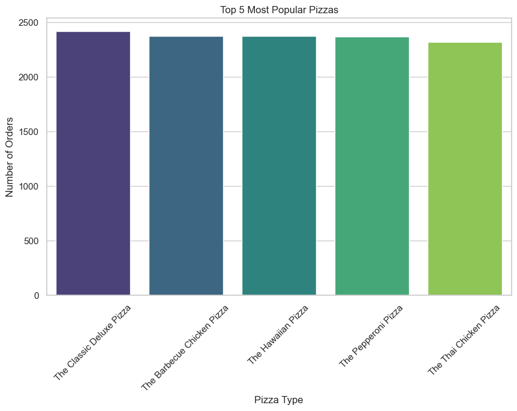
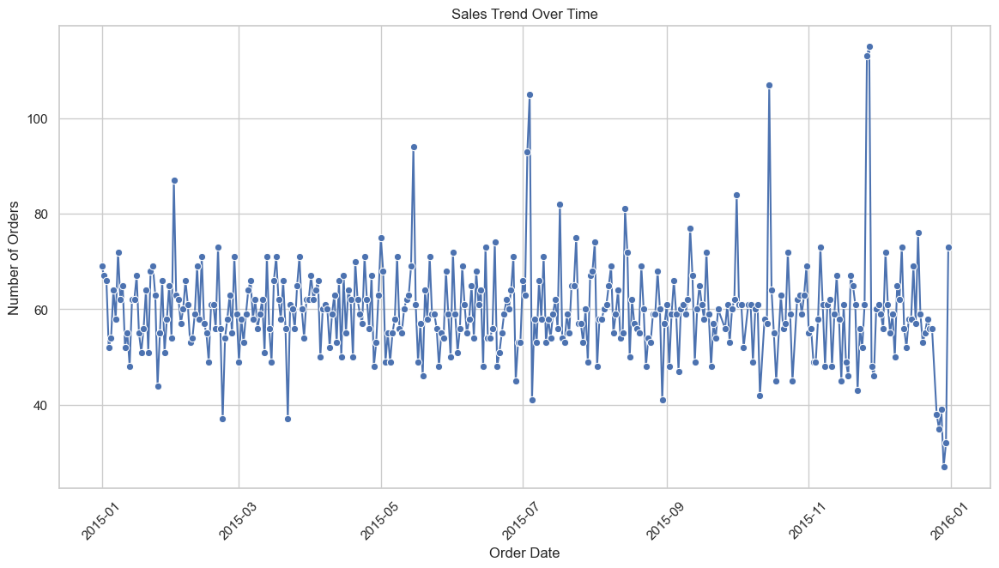
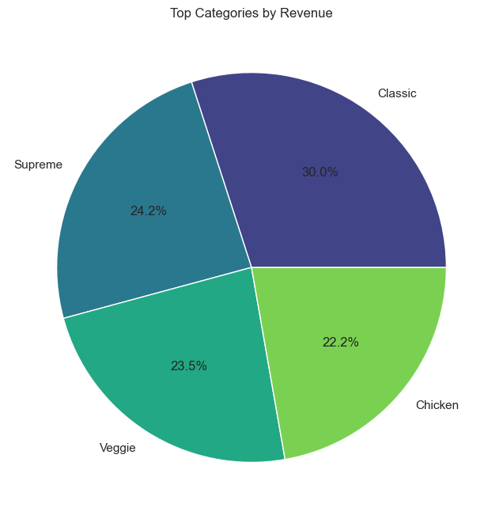
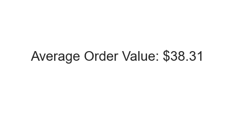
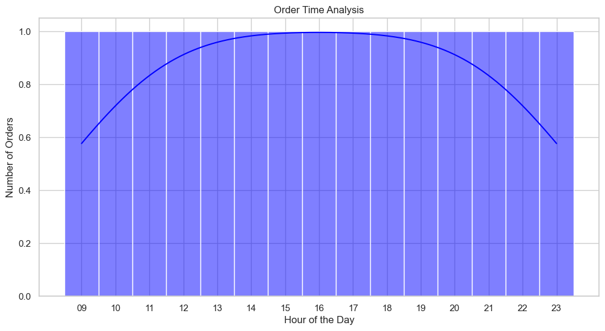

# Pizza Order Analytics

## Introduction
This project provides a detailed analysis of pizza order data using SQL for querying and Python for data visualization. The goal is to extract meaningful insights from the data and present them in a visually appealing manner.

## Project Description
A comprehensive analysis involving the following steps:
1. **Data Extraction with SQL**: Performing various SQL queries to gather insights.
2. **Data Analysis with Python**: Using pandas to manipulate data ,matplotlib and seaborn to create visualizations.
3. **Presentation with Canva**: Designing a professional presentation template on Canva with the visualizations.

## Skills and Tools Used
- **SQL (MySQL Workbench)**: Data querying and manipulation.
- **Python (Jupyter Notebook)**: Data analysis and visualization.
- **pandas**: Data manipulation library in Python.
- **matplotlib**: Plotting library in Python.
- **seaborn**: Data visualization library in Python.
- **Canva**: Design tool for creating visual presentations.
- **GitHub**: Version control and project sharing.

## Setup Instructions
1. Clone the repository:
    ```bash
    git clone https://github.com/yourusername/pizza-order-analytics.git
    ```
2. Install required Python packages:
    ```bash
    pip install pandas matplotlib seaborn
    ```

## Usage Instructions
1. Open the Jupyter Notebooks in the `/scripts` folder to see the data analysis and visualization process.
2. Execute the SQL queries in the `/sql_queries` folder using MySQL Workbench.
3. Generate visualizations with matplotlib in the Jupyter Notebooks.
4. Export the visualizations and incorporate them into Canva.
5. View the final presentation PDF in the `/canva` folder.

## Visualization Examples
### Top 5 Most Popular Pizzas


### Sales Trend Over Time


### Top Categories By Revenue


### Average Order Value


### Order Time Analysis


### Revenue Contribution By Pizza Size


### Pizza Type Diversity in Order


## Canva Presentation
The complete presentation can be found [here](canva/pizza_order_analytics_presentation.pdf).

## Contact Information
For any queries, please contact:
- **Name**: Ritwicka Majumder
- **Email**: ritwicka.majumder7@gmail.com
- **LinkedIn**: [Ritwicka Majumder](www.linkedin.com/in/ritwicka-majumder-36b4b7255)
